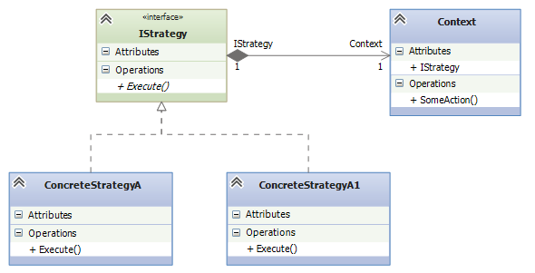
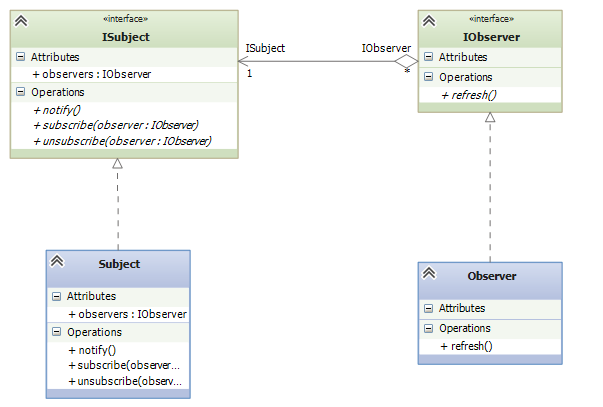
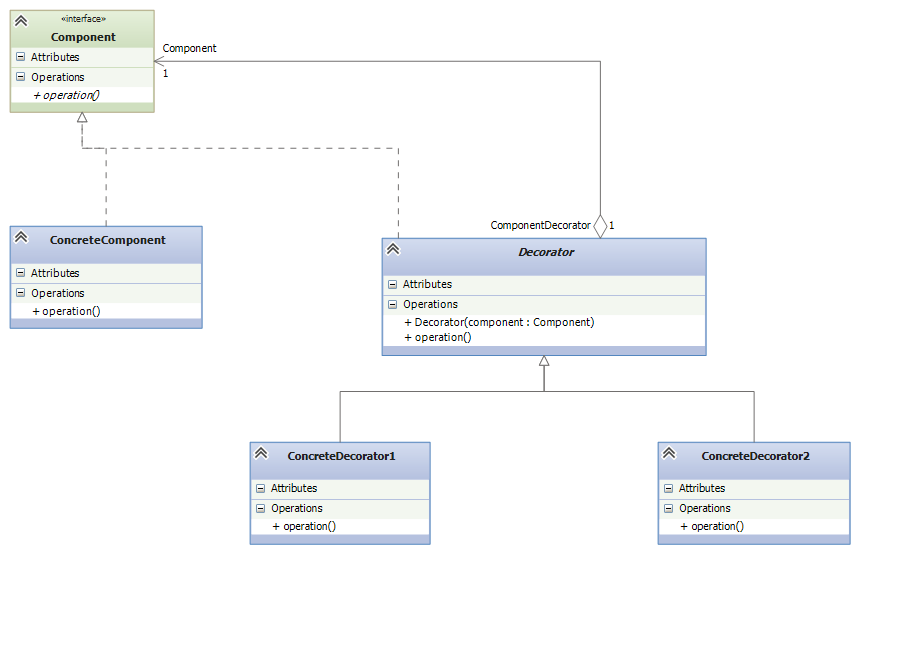

# Course design patterns JavaScript and TypeScript

# Run TypeScript
```
ts-node <file-name>.ts
```

## Singleton Pattern
El patrón de diseño Singleton es un patrón creacional que garantiza que una clase tenga una única instancia y proporciona un punto global de acceso a ella.
[Mas de Singleton](./01_singleton/README.md)


## Strategy Pattern
El patrón de diseño Strategy es un patrón de comportamiento que permite definir una familia de algoritmos, encapsular cada uno de ellos y hacerlos intercambiables. El patrón Strategy permite que el algoritmo varíe independientemente de los clientes que lo utilizan.
[Mas de Strategy](./02_strategy/README.md)




## Observer Pattern
El patrón de diseño **Observer** es un patrón de comportamiento que define una dependencia uno-a-muchos entre objetos, de modo que cuando un objeto cambia de estado, todos sus observadores son notificados automáticamente.
[Mas de Observer](./03_observer/README.md)



## Decorator Pattern
El patrón de diseño **Decorator** es un patrón estructural que permite agregar funcionalidades adicionales a un objeto dinámicamente sin modificar su estructura original.
[Mas de Decorator](./04_decorator/README.md)

